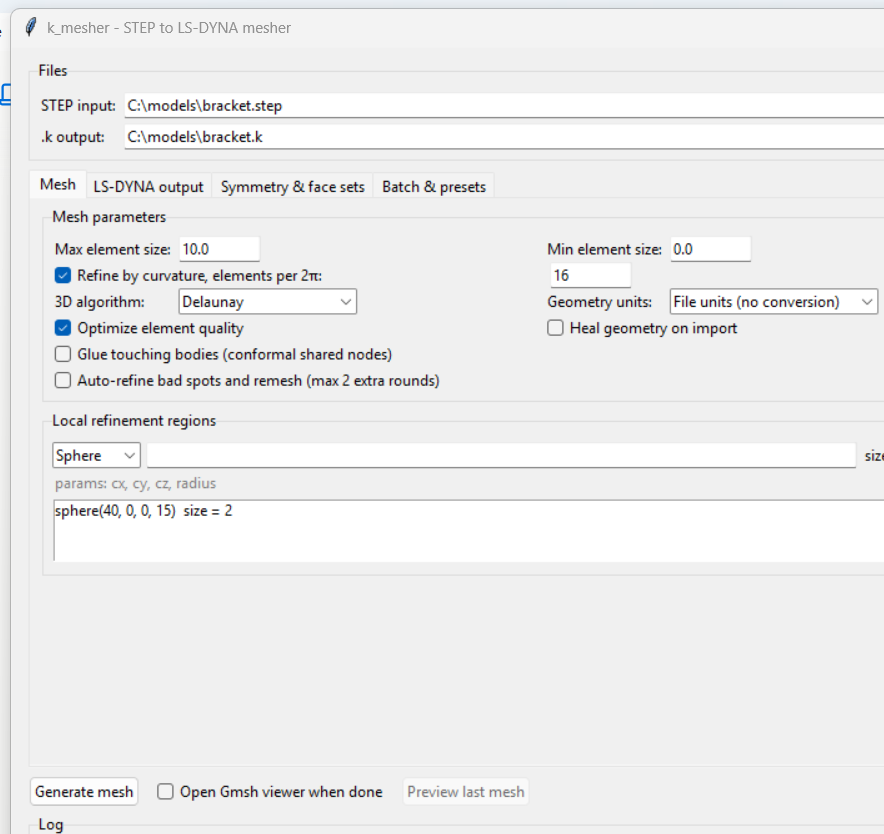
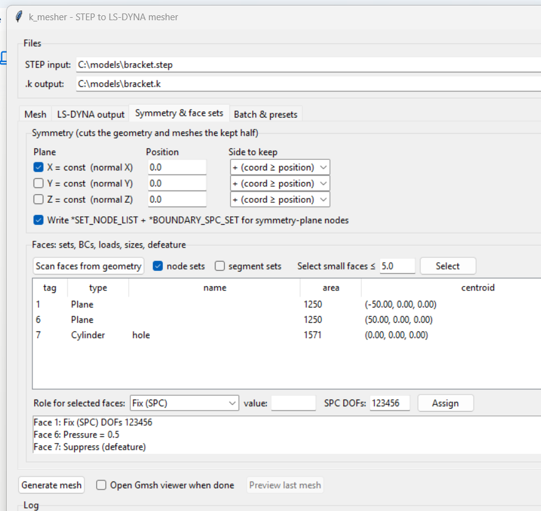

# k_mesher

[](https://github.com/pmquang87/k_mesher/actions/workflows/ci.yml)

Mesh CAD geometry (STEP / IGES / BREP) or a surface tessellation
(STL / OBJ / PLY) into solid tetrahedra (TET4/TET10) or shells (TRI3/QUAD4)
and export an LS-DYNA keyword file (`.k`). Features: symmetry planes
(half/quarter/eighth models) with separate node-set and boundary-condition
options (symmetric / anti-symmetric / fixed / custom DOFs), per-body parts,
defeaturing (remove holes/fillets), face sets with BCs and loads
(SPC / pressure / force), local mesh refinement (regions and per-face sizes),
LS-DYNA quality criteria with failed-element sets, quality-driven auto-remeshing,
mass properties, shell integrity checks, parameter presets and a batch queue.
Meshing is done with [gmsh](https://gmsh.info) (OpenCASCADE kernel), the GUI is
plain tkinter.

**Input formats** — STEP (`.step/.stp`), IGES (`.iges/.igs`) and BREP
(`.brep/.brp`) are B-rep CAD and support the full pipeline (solids, symmetry,
defeature, face sets). STL/OBJ/PLY are surface tessellations: meshed as-is with
shells, or — when the surface is watertight — tetrahedralized (TET4/TET10) by
reconstructing the enclosed volume. Tessellations still have no CAD geometry, so
symmetry/defeature/refinement need a B-rep. See
[docs/cad_formats.md](docs/cad_formats.md) for the full survey of CAD formats and
what is / isn't importable.

| Mesh parameters & refinement | Symmetry, face BCs/loads, defeature |
|---|---|
|  |  |

## Install & run

```
pip install -r requirements.txt
python main.py
```

Or double-click / run `start_gui.py` — it automatically uses the project's
`.venv` interpreter (no console window) regardless of which Python starts it.

Command line (batch) use:

```
python mesh_cli.py part.stp --size-max 8 --size-min 1
python mesh_cli.py part.iges -o half.k --sym x --mat --elform 13
python mesh_cli.py part.brep --etype tet10 --algo hxt --sym x:0:+ --sym y:5:-
python mesh_cli.py part.stl --etype tri3 --thickness 1.2      # STL -> shells
python mesh_cli.py part.stl --etype tet4                      # watertight STL -> tets
python mesh_cli.py sheet.stp --etype quad4 --thickness 2.5
python mesh_cli.py part.stp --sym x --sym-constraint antisymmetric
python mesh_cli.py part.stp --sym x --no-sym-spc              # node set, no BC
python mesh_cli.py part.stp --sym x --sym-dofs 13             # custom SPC DOFs
python mesh_cli.py part.stp --sym x --sym-segset              # + plane segment set
python mesh_cli.py part.stp --list-faces
python mesh_cli.py part.stp --face-nodeset 7 --face-segset 12
python mesh_cli.py part.stp --refine-sphere 0:0:0:15:1.5 --face-size 6:2.0
python mesh_cli.py part.stp --defeature 7 --spc 1 --pressure 6:0.5 \
                            --force 4:z:-500 --implicit-cards --auto-refine
```

`python mesh_cli.py -h` lists all options. GUI settings are remembered
between sessions in `k_mesher_settings.json` (written on every run and on
window close).

## Workflow (GUI)

1. **Files** — pick the CAD/mesh input (STEP/IGES/BREP or STL/OBJ/PLY); the
   `.k` output path is auto-filled.
2. **Mesh tab**
   - *Max/Min element size* in the model's length units.
   - *Refine by curvature* — targets N elements per full circle, so holes and
     fillets get smaller elements automatically.
   - *3D algorithm* — Delaunay (robust default), Frontal, or HXT (fast,
     multithreaded, recommended for large models).
   - *Geometry units* — leave on "File units" normally; force mm/m/etc. if a
     STEP file imports at the wrong scale.
   - *Heal geometry* — for dirty CAD (fixes degenerated/small edges and faces).
   - *Glue touching bodies* — merges coincident faces of touching solids so
     the mesh shares nodes at the interfaces (bodies behave as bonded).
   - *Local refinement regions* — sphere (cx, cy, cz, radius) or box
     (xmin..zmax) regions with their own element size, e.g. around a stress
     concentration. Keeps the node count down compared to global refinement.
3. **LS-DYNA output tab**
   - Element type:
     - **TET4** solid (ELFORM 10 or 13)
     - **TET10** solid (ELFORM 16 or 17) — for implicit stress analysis
       TET10 + ELFORM 16 is strongly recommended; linear tets are
       artificially stiff in bending.
     - **Shell TRI3** (ELFORM 4 or 17) — triangles on the model surfaces.
     - **Shell QUAD4** (ELFORM 16 or 2) — quad-dominant recombined mesh
       (a few triangles remain, written as degenerate quads).
     Shells take a *thickness* (written on `*SECTION_SHELL`, NIP = 5,
     SHRF = 0.8333). Surface-only STEP files are meshed directly with
     shells; for solids, the body's boundary surfaces are meshed.
   - Base part ID: each solid body in the STEP file becomes its own `*PART`
     (PID, PID+1, ...; shell meshes are one part). Start node/element/set IDs
     (the last renumbers node/segment/SPC/element sets) let you merge into
     assembly decks without ID clashes.
   - Optional `*MAT_ELASTIC` card (E, ν, ρ; defaults are steel in mm-t-s).
     Without it, define your own `*MAT_` with MID = base PID.
4. **Symmetry & face sets tab**
   - Symmetry: tick X/Y/Z planes, set the plane position and which side to
     keep. The geometry is cut by boolean intersection *before* meshing, so
     the mesh conforms exactly to the plane. The node set and the boundary
     condition are now **separate options**:
     - *Write node set* — emit `*SET_NODE_LIST` for the symmetry-plane nodes.
     - *Apply boundary condition* — emit `*BOUNDARY_SPC_SET`, with a choice of
       constraint: **Symmetric** (default; fixes the normal translation and the
       two in-plane rotations), **Anti-symmetric** (the complement, for
       anti-symmetric loading), **Fixed** (all 6 DOFs), or **Custom DOFs** (type
       the DOF digits, e.g. `13`).

     Turn the BC off to get just the node set (e.g. to apply your own
     constraint, contact or coupling); turning the node set off while the BC is
     on still writes the node set the SPC references. *Write segment set*
     additionally emits a `*SET_SEGMENT` for the boundary faces lying on each
     symmetry plane (solids only — useful for contact or pressure on the cut
     face). (STL/OBJ/PLY inputs have no CAD geometry to cut, so symmetry is
     unavailable for them.)
   - Face sets: **Scan faces from geometry** lists all model faces with
     type, area and centroid (uses the current symmetry/glue settings —
     rescan after changing them). "Select small faces" finds candidates for
     defeaturing. Select faces (Ctrl-click) to write `*SET_NODE_LIST` and/or
     `*SET_SEGMENT`, or assign a **role**:
     - *Fix (SPC)* — `*BOUNDARY_SPC_SET` with chosen DOFs (1-6),
     - *Pressure* — `*SET_SEGMENT` + `*LOAD_SEGMENT_SET` (unit ramp curve,
       magnitude as scale factor),
     - *Force X/Y/Z* — `*SET_NODE_LIST` + `*LOAD_NODE_SET` (the total force
       is divided over the face nodes),
     - *Mesh size* — local element size on that face,
     - *Suppress (defeature)* — remove the face (hole, fillet, tangent
       sliver) from the solid with OpenCASCADE defeaturing before meshing.
       NOTE: defeaturing changes the face tags of the remaining faces —
       rescan to see the resulting geometry before assigning other roles.
5. **Batch & presets tab** — save/apply named parameter presets; queue
   several STEP files (each job snapshots the current settings) and run them
   unattended.
6. **Generate mesh** — runs in the background; the log shows per-stage
   timings, element counts, mesh volume/area, mass + COG + inertia (when a
   material is set), a quality histogram (SICN, 1.0 is a perfect tet), an
   LS-DYNA-style **quality criteria table** (aspect ratio, SICN, warpage,
   min angle; failing elements are written as `*SET_SOLID`/`*SET_SHELL` for
   review in LS-PrePost), shell integrity checks (free edges, non-manifold
   edges, normal orientation — normals are auto-aligned), and the locations
   of badly shaped elements (usually dirty CAD spots — defeature them).
   "Auto-refine bad spots" remeshes up to 2 extra rounds with refinement
   spheres at the worst locations and keeps the best mesh; note that slivers
   caused by tangent faces cannot be refined away — defeature instead.
   "Preview last mesh" opens the interactive Gmsh viewer.

## Output file contents

```
*KEYWORD / *TITLE
*PART                 (one per solid body; SECID = MID = base PID)
*SECTION_SOLID /      (chosen ELFORM; SECTION_SHELL carries the thickness)
*SECTION_SHELL
*MAT_ELASTIC          (optional)
*NODE                 (I8 id, 3 x E16.9 coordinates)
*ELEMENT_SOLID        (TET4: one line, tet as degenerate hex;
                       TET10: two-line format, 10 nodes)
*ELEMENT_SHELL        (quads n1..n4, triangles as n1 n2 n3 n3)
*SET_NODE_LIST_TITLE  (symmetry planes and selected faces)
*BOUNDARY_SPC_SET     (one per symmetry plane)
*SET_SEGMENT_TITLE    (selected faces; triangles as degenerate quads)
*END
```

All tets are checked and reoriented for positive volume before writing.
TET10 node ordering follows the LS-DYNA convention (mid-side nodes 5-10).
Shell normals and segment set normals follow the gmsh surface orientation —
check the sign when applying pressure loads. The symmetry SPC constrains the
normal translation plus the two in-plane rotations, which is correct for
both solids and shells.

## Performance notes

The default Delaunay volume mesher and the Netgen optimizer are
**single-threaded** — on large models most of the wall time is one core at
100%. The log shows per-stage timings so you can see where time goes. For
big meshes:

- Switch the 3D algorithm to **HXT** — it is multithreaded (all cores) and
  usually several times faster; quality is comparable.
- Element count grows roughly with `1/size³`: halving the element size means
  ~8x more elements and far more than 8x meshing time. Prefer local
  refinement regions over a small global size.
- Disabling "Optimize element quality" skips the (serial) optimization passes;
  useful for quick previews of the sizing.

## Project layout

| File | Purpose |
|---|---|
| `main.py` | entry point, launches the GUI |
| `start_gui.py` | launcher that relaunches via the project `.venv` (double-click friendly) |
| `mesh_cli.py` | command-line interface for batch meshing |
| `gui.py` | tkinter GUI |
| `mesher.py` | gmsh meshing core (STEP/IGES/BREP/STL/OBJ/PLY import, symmetry, refinement, tet/shell extraction) |
| `dyna_writer.py` | LS-DYNA `.k` writer |
| `preview.py` | standalone Gmsh viewer process |
| `examples/make_test_step.py` | generates test parts (STEP + IGES/BREP/STL) |
| `tests/test_headless.py` | end-to-end tests (all element types, formats, symmetry BCs, parts, sets, refinement) |
| `docs/cad_formats.md` | survey of CAD input formats and what is importable |

## Notes on element types

Hex meshing of arbitrary STEP solids is not something gmsh does
automatically — that would need transfinite/swept regions or an external hex
mesher, so solid meshes are tetrahedra only. (gmsh's tet-subdivision "all-hex"
mode exists but produces badly distorted hexes and is deliberately not
offered.) Shells are meshed on the model's surfaces: use them for
surface-only STEP exports or thin-walled parts; midsurface extraction is not
performed, so export midsurfaces from CAD when shell-meshing solids-like
sheet parts.
